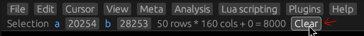

# Selecting data

## A-B select

Click somewhere in a view to set the cursor to that location.
You can then press `shift+1` in View mode to set the `A` point of a selection,
and `shift+2` to set the `B` point of a selection.
Once you have both an `A` and a `B` point, the selection is the region spanning
`A` and `B`.

## Select all

You can select everything in a view with `Edit->Select all in view` or `Ctrl+A`.

## Mouse drag selection

Click a byte and drag the mouse, releasing it when the desired region is selected.

<video autoplay loop> <source src="mouse-select.mp4"> </video> 

## Mouse block multi-selection

Hold down left `Alt` and draw a rectangle with the mouse to select a block.

<video autoplay loop> <source src="block-select.mp4"> </video> 

## Unselecting

You can press the `clear` button in the top bar, or press `Esc`.

