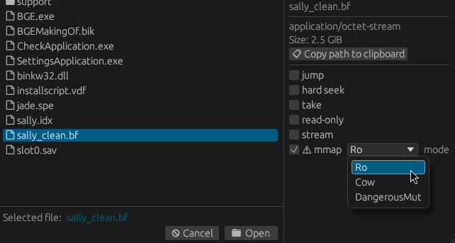

# Memory mapped files

Hexerator supports opening files as [memory mapped](<https://en.wikipedia.org/wiki/Memory-mapped_file>).

If you have a large file that can't fit into memory, you can open it as memory mapped
to lazily access it without loading the whole thing into memory upfront.

You can also access things like block devices this way.

<div class="warning">

**Note:** Hexerator needs exclusive access to memory mapped files.

Sound behavior cannot be guaranteed if there are other programs accessing the same file.

Hexerator itself currently does not use any kind of locking mechanism, so you have to ensure
this manually.

The `--unsafe-` prefix of the CLI flag reflects this.


</div>

## CLI flags

```
--unsafe-mmap <mode>
    Try to open the source using mmap rather than load into a buffer

    Possible values:
    - ro:            Read-only memory map. Note: Some features may not work, as Hexerator was designed for a mutable data buffer
    - cow:           Copy-on-write memory map. Changes are only visible locally
    - dangerous-mut: Mutable memory map. *WARNING*: Any edits will immediately take effect. THEY CANNOT BE UNDONE

--mmap-len <len>
    Assume the memory mapped file is of this length (might be needed for looking at block devices, etc.)
```

- The recommended mode is `ro` for read-only access.
- `cow` can be used to allow saving changes to a memory mapped file, but currently I'm not sure if the implementation is sound/bug-free.

<div class="warning">

**WARNING:** `dangerous-mut` creates a direct mutable memory mapping.

**Any changes you make will have immediate effect. They CANNOT be undone.**

Use only as a last resort, and with extreme caution.

</div>

## File dialog

You can also open a file as memory mapped from the file dialog UI.

Check the `mmap` flag, and select the mode from the `mode` dropdown menu.


