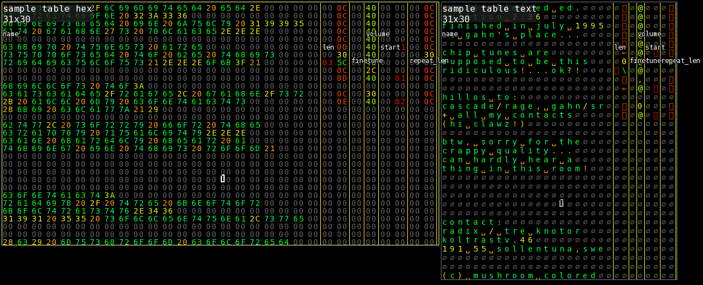

# Structs

You can define structs with the [Rust language](<https://www.rust-lang.org/>) struct syntax.

## Syntax

Here is an example struct for an instrument in the [Protracker music format](<https://www.aes.id.au/modformat.html>).

```Rust
struct Sample {
	name: [u8; 22],
	len: u16,
	finetune: u8,
	volume: u8,
	start: u16,
	repeat_len: u16,
}
```

## Adding structs

You can toggle the structs window with `Meta -> Structs` or the `F11` key.

Write or paste your struct definition in the code editor, then click the `Save` button at the bottom.

<video autoplay loop> <source src="add-struct.mp4"> </video> 

## Using as a ruler

1. Click `View -> Ruler -> Add ruler for current view` to add a ruler if you haven't.
2. Hover over the `struct` menu button, and click the struct you want to use for the ruler.

The ruler will now use your struct definition.
You can also hold down `Alt` to display the field names as an overlay.


