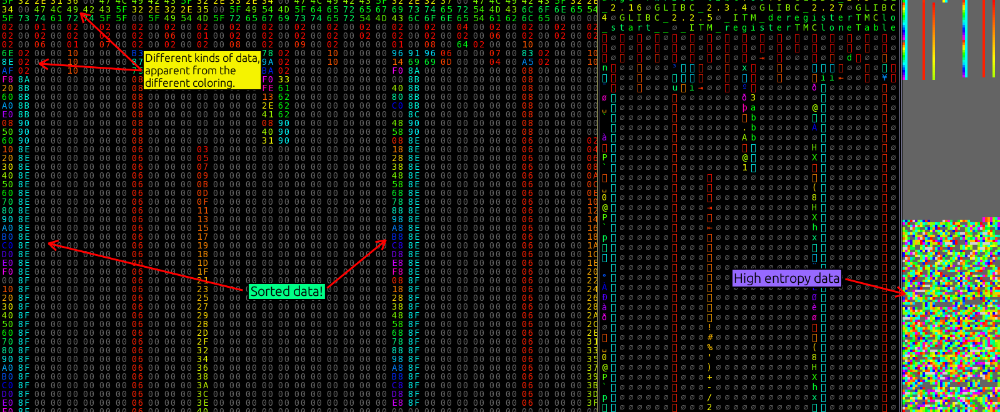
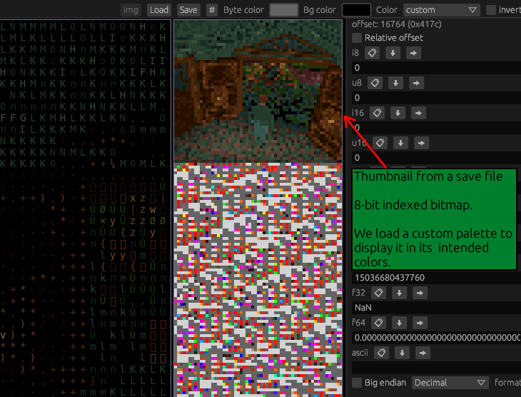
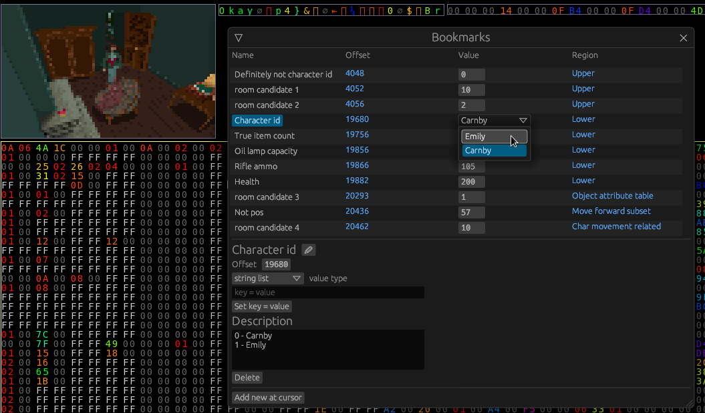

Legend:
- [ ] = Planned
- [x] = Implemented

# Features
- [x] [Colorized values](#colorized-values)
  - [x] [Custom color palettes](#custom-color-palettes)
- [x] [Easy data alignment](#easy-data-alignment)
- [x] [Built-in process memory editing](#process-memory-editing)
- [x] [Multiple source types](#multiple-source-types) (file/streamed sources)
- [x] [Rich command line options](commandline.md)
- [x] [Bookmarks](#bookmarks)
- [x] [Multiple configurable views](#multiple-configurable-views)
- [x] [Lua scripting support](#lua-scripting-support) for various operations, like fill.
- [x] [External command support](#external-command-support)
- [x] [Diffing functionality](#diffing)
- [ ] [Huge file support through memory mapped files](#huge-file-support-through-memory-mapped-files)

# Non-features
- [Insertion](#insertion)
- [Memory holes support, generic support for huge data](#memory-holes-support-generic-support-for-huge-data)

# Features

## Colorized values
Colorizing values helps a lot with human pattern recognition.

### Custom color palettes

Custom color palettes can be saved and loaded, and generated through various means.

## Easy data alignment
Hexerator considers it important to easily align data with shortcut keys. Proper alignment can make a lot of difference
with pattern recognition.

<iframe width="1280" height="720" src="https://www.youtube.com/embed/GhPh_y1PjTU" title="Viewing Cave Story credits slide show with hexerator" frameborder="0" allow="accelerometer; autoplay; clipboard-write; encrypted-media; gyroscope; picture-in-picture" allowfullscreen></iframe>

## Process Memory editing
Built-in support for opening memory of a process and viewing/editing it.
Can be used to cheat in games, or discover how different applications store data in memory.

<iframe width="1280" height="699" src="https://www.youtube.com/embed/OPHMIEW_vh4" title="Hexerator: Process memory editing demonstration" frameborder="0" allow="accelerometer; autoplay; clipboard-write; encrypted-media; gyroscope; picture-in-picture" allowfullscreen></iframe>

You need to run hexerator with root/admin privileges to open memory of other processes.

## Multiple source types
Hexerator supports opening both files and streamed sources like standard input or character devices like `/dev/urandom`.

## Bookmarks

Quickly and easily save and access points of interest in the data.

Additional support for setting a type for a bookmark to display and manipulate the data
associated with it.

## Multiple configurable views

You can have different views into different regions of the same file, with
different column counts and other configurable properties.

## Lua scripting support

You can write Lua scripts to:
- Fill a selection
- Generate a custom color palette
- More coming in the future

## External command support

Support for executing a custom external command on selected data.

<iframe width="1280" height="720" src="https://www.youtube.com/embed/xnw4cdD9r-w" title="Playing sounds in binary files with Hexerator" frameborder="0" allow="accelerometer; autoplay; clipboard-write; encrypted-media; gyroscope; picture-in-picture" allowfullscreen></iframe>

## Diffing

There is basic support for showing differences between
- The current buffer and its source file
- The current buffer and an arbitrary file
- The current metadata and the clean metadata
- Support for more coming in the future

For now diffing is pretty barebones, shown as a list of offsets.
It will be better fleshed out in the future

## Huge file support through memory mapped files

Huge files that couldn't fit in memory can be opened as memory mapped files through a command line
option.
To be implemented.

# Non-features

## Insertion
Insertion would complicate implementation, and for most binary data, including process memory, it will just mess up the data.

## Memory holes support, generic support for huge data
Originally, I wanted to have a generic mechanism for loading only parts of files, but I found that
it would make the implementation way more complex, and possibly inefficient, so I dropped the idea.
Huge files will be eventually supported through memory mapped file support.