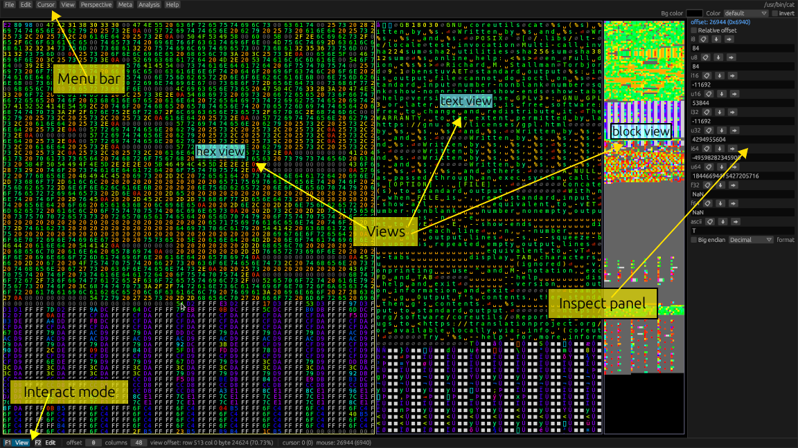

# Ui Overview

Open a file either with a [command line argument](../commandline.md), or by selecting `File->Open...` from the top menu.

You should be greeted with a sight similar to this:

## Menu bar

At the top is the menu bar. It contains most actions you can perform.
Many actions also have shortcut keys, which are displayed on the right side of the menu buttons.

## Views

At the center are the views. Views are the main way you can view and interact with the file you opened.
By default, you get 3 views:

1. A Hex view, which displays data in a [hexadecimal format](https://en.wikipedia.org/wiki/Hexadecimal).
2. A Text view, which makes it easier to recognize text.
3. A Block view, which can serve as a minimap, or display embedded graphical data.

## Interact mode

Hexerator has two interaction modes.

### View mode

Press `F1` to activate.

This mode is used to navigate around the file in order to discover its contents.

- The arrow keys scroll the active view, letting you navigate around the file.
- You can hold down `left shift` to scroll faster.
- `Page up` and `Page down` keys scroll a page's worth of content.
- `Home` and `End` navigate to the beginning and end of the file respectively.
- `ctrl` + `Left`/`Right` arrow keys to change the column count of your active [perspective](./meta-overview.md#perspectives).
- `ctrl` + `Up`/`Down` arrow keys to change the starting offset of your active [region](./meta-overview.md#regions).

### Edit mode

Press `F2` to activate.

This mode is used to edit the file by entering text through the keyboard.

- The arrow keys move the edit cursor.

## Inspect panel

The inspect panel provides multiple interpretations of the data the edit cursor or mouse is pointing at.
It can be useful in figuring out what type of data we're dealing with.