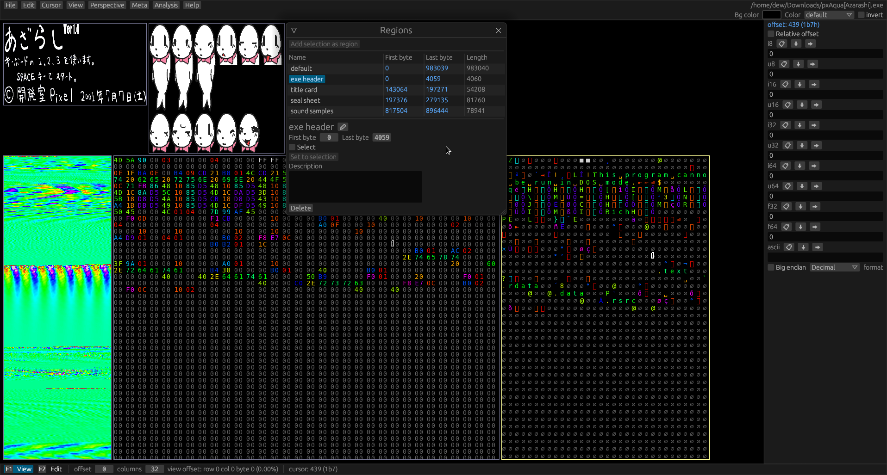

# Hexerator

Hexerator is a [hex editor](https://en.wikipedia.org/wiki/Hex_editor) with a [unique feature set](./features.md).

Its main focus is to make looking at binary files fun and easier to comprehend, but it also aims
to be a good general-purpose hex editor, suitable for a wide range of uses.

Here is what it looks like:

[Click here to get Hexerator!](./get.md)