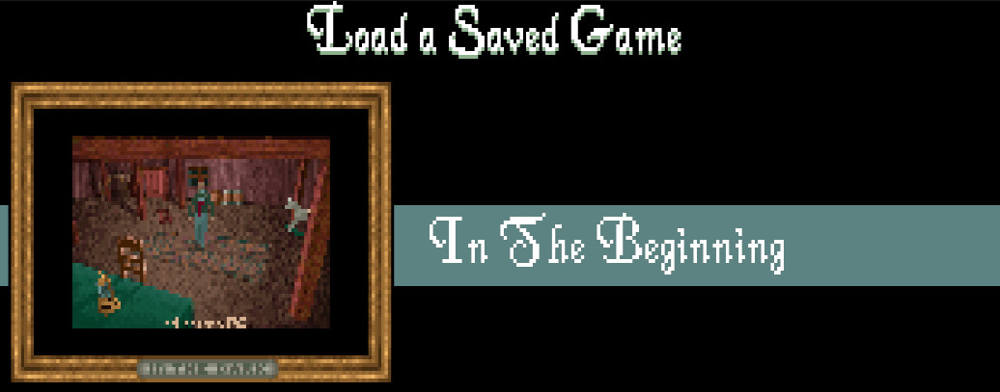

# Tutorial: Alone in the Dark save files

In this tutorial, we'll go through the process of reverse engineering the save file format
of the 1992 video game, [Alone In The Dark](<https://en.wikipedia.org/wiki/Alone_in_the_Dark_(1992_video_game)>).

You can download the save file (`SAVE0.ITD`) to follow along:

<a href="../assets/SAVE0.ITD">Click here to download SAVE0.ITD</a>