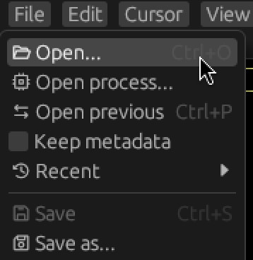
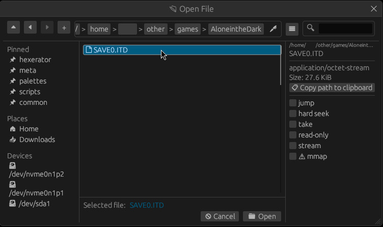

# Opening the file

Before we can do anything else, we need to open the file.

We can do this either through the [GUI](#gui) or the [command line](#command-line).

## Gui

In the top menu bar, click `File->Open...`, or press `ctrl + O`.

This opens a file dialog where you can pick the file you want to open.

The file dialog is powered by [egui-file-dialog](<https://github.com/fluxxcode/egui-file-dialog>).
You can look at a list of key bindings [here](<https://github.com/fluxxcode/egui-file-dialog?tab=readme-ov-file#keybindings>).

## Command Line

Hexerator offers a [rich command line API](../commandline.md).
But for the simple case of opening a file, we can just provide the path to the file as the argument.

`$ hexerator SAVE0.ITD`
