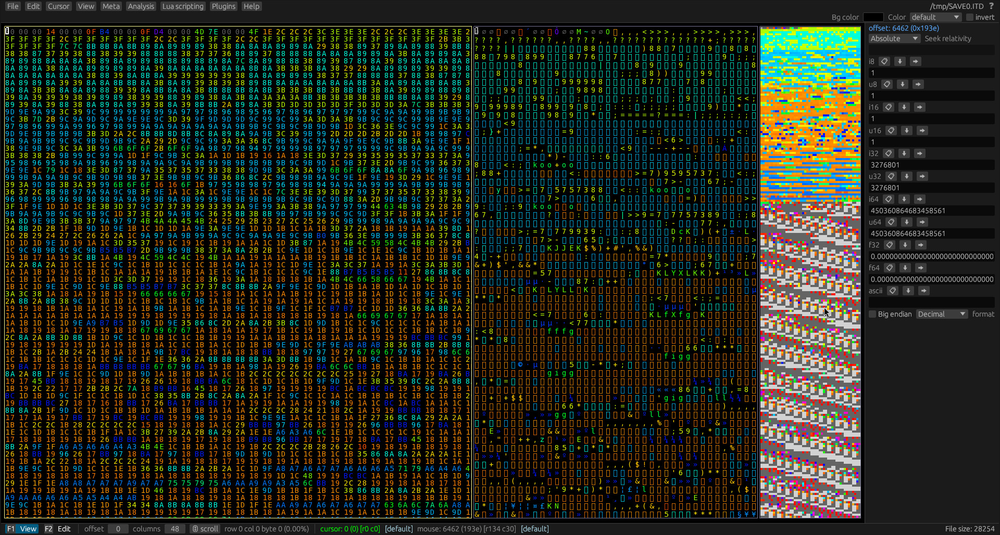
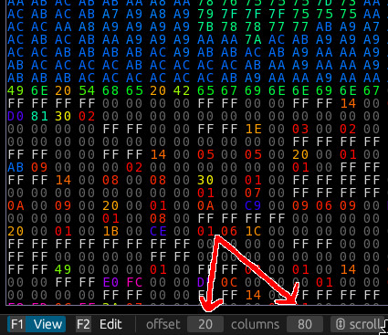

# Aligning Data

Once you have opened the save file, you should see something like this.

By default, there are 3 views:

1. A hex view, on the left side
2. A text view in the center
3. A so-called block view on the right. You can think of it like a minimap.

The block view is showing something funky at the top.
It almost looks like some kind of garbled up image.
I wonder if we could look at it from another perspective to better understand what kind of data it is...

We can do that by shifting the number of columns around.
Hold down `ctrl` and the left and right arrow keys to shift the perspective around.
Try messing around until you can make sense of the image.

Spoiler

In this case, the magic number is 80 columns.

That makes a lot more sense. Although it's split in the middle.
It would be nice to adjust it so it begins at the left edge of the block view.

No problem. You can press `ctrl` + up and down arrow keys to adjust the offset.

Spoiler

The magic offset in this case is 20.

Alright, this looks very much like the thumbnail for the save file.

We can confirm this by using a custom color palette (which you can download here: [aitd.pal](../assets/aitd.pal))

(TODO: Link to help on how to load custom color palettes)

**Tip:** You can always keep track of the view offset and columns in the bottom panel.

