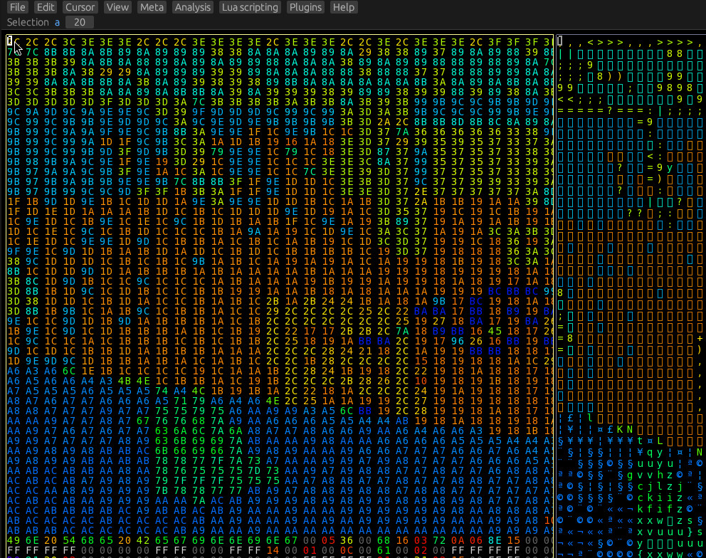
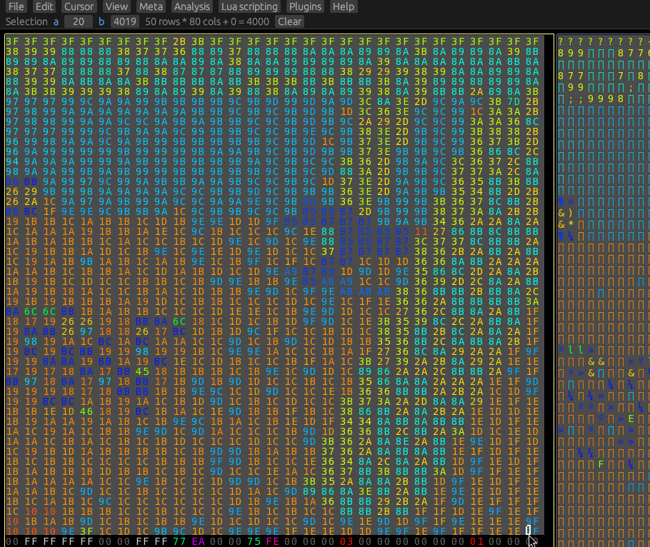
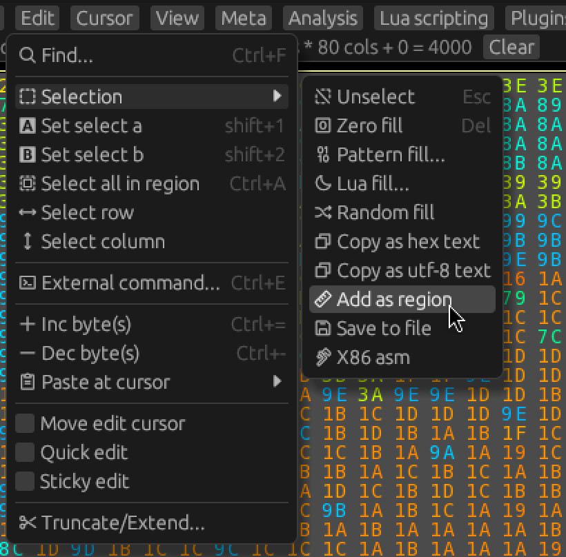
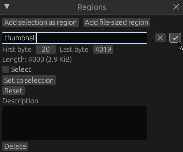
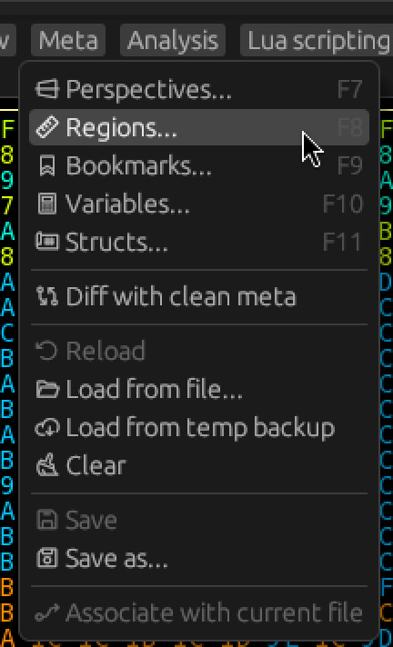

# Selections and Regions

Now that we have determined where the thumbnail for the save file is, we should note it down,
and also inform Hexerator about it.

## A-B selection

First, let's select the thumbnail.
The easiest way we can do this is with a-b selection.
We'll use the hex view, since it has bigger elements that are easier to click.

- First, click the hex view, then press `ctrl+Home` (scroll to beginning) to make sure you're scrolled at the beginning of the view.
- Then click the first byte of the view, and press `shift+1` (a-select).

- Now you can press `End` (scroll to last column)
- The click the last byte of the thumbnail, and press `shift+2` (b-select).

## Regions

Now click `Edit -> Selection -> Add as region` in the top menu.

This will open the Regions window, where you can name your newly created region.
Let's name it `thumbnail`. You can press enter once finished

You can open the regions window any time by clicking `Meta -> Regions` or pressing `F8`.

