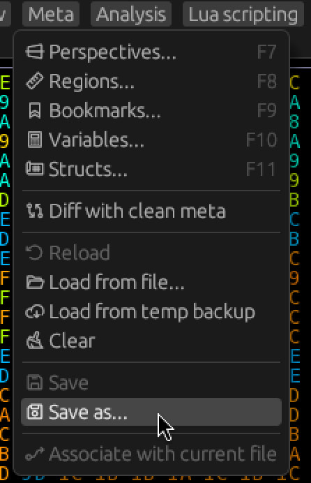
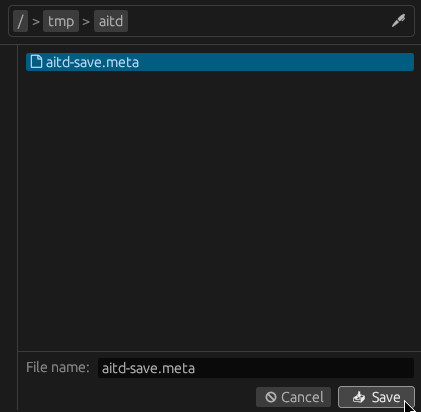
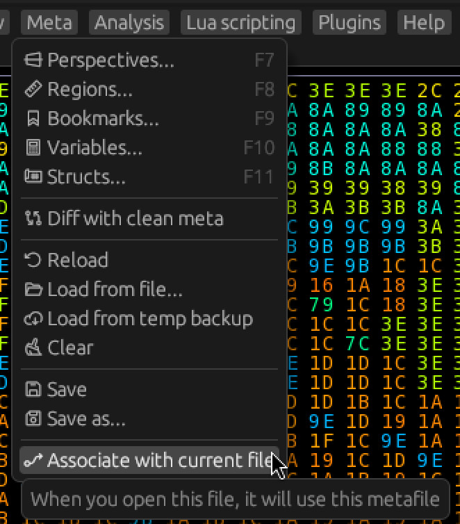

# The Metafile

The information we have discovered about a file is called the **Meta**.
It can be saved into a **Metafile**.
Let's save our progress so far!

Click `Meta -> Save As...` and save your metafile into a location of your choosing.

Now any time you want to save the metafile, you can click `Meta -> Save`.

Additionally, you can click `Meta -> Associate with current file` to associate the current file
with the current metafile.
This will make it so any time you open this file, it will use this metafile automatically.

## Meta items

Here is an overview of the 3 most important meta items:

- Region

  A region with a beginning and an end offset (inclusive).
  Our thumbnail starts at offset 20, and ends at offset 4019.

- Perspective

  Adds column count information to a region.
  For example, our thumbnail has 80 columns.

- View

  A configurable view into a perspective.
  The 3 basic view types are Hex, Text, and Block (minimap).