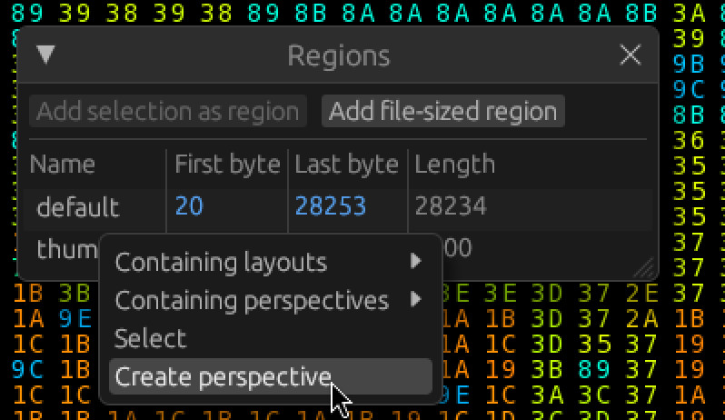
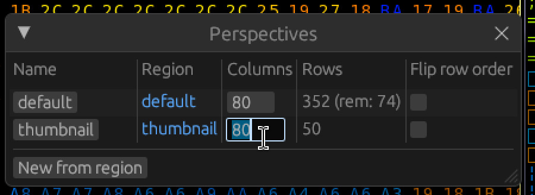
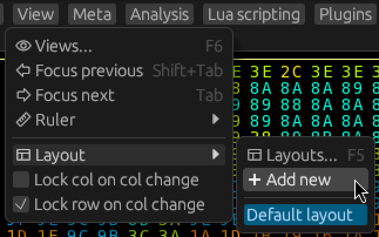
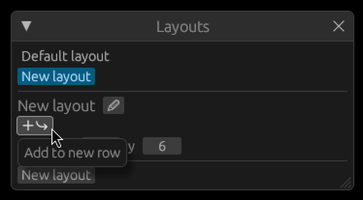
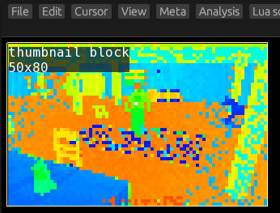
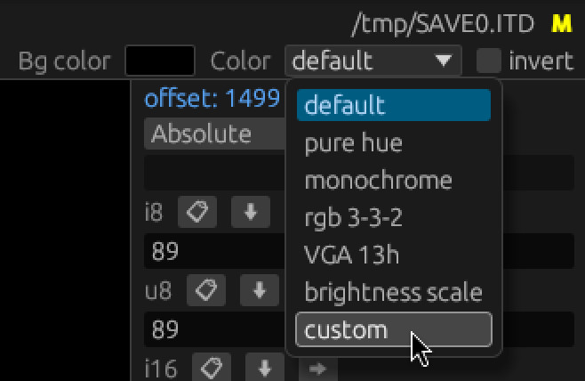
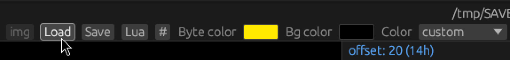
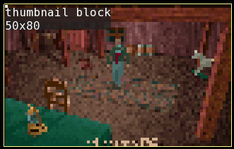

# Perspectives, Views, Layouts

## Adding a perspective

Make sure the Regions window is open (`Meta -> Regions` or `F8`).

Right click your `thumbnail` region, and click `Create Perspective` in the context menu.

The Perspectives window will pop up.
You can press enter to accept the name `thumbnail` for the newly created perspective.

Assuming you haven't fiddled with the column count, it will be created with 80 columns.
If that's not the case, you can drag or click the widget in the `Columns` row to adjust it.

## Adding a layout

Let's create a dedicated space where we can put the thumbnail, and other new discoveries.

Click `View -> Layout -> Add new`.

This will switch to a new (empty) layout, and open the layouts window.

## Adding a view

Click the `Add to new row` button.

From the popup menu, click `New from perspective -> thumbnail -> Block`.

This will add a new block view of the thumbnail to the perspective.

**Tip:** You can hold down the left Alt key to display some additional hover info about the visible views.

## (Bonus) Custom color palette

As a final touch, we can set an appropriate color palette.
If you haven't already, you can download [aitd.pal](../assets/aitd.pal).

On the right side of the top panel, there are some controls for the color palette of the current view.

Select `custom` from the `Color` dropdown menu.

You can then press the `Load` button to load a custom palette from a file.
In this case, the `aitd.pal` you presumably downloaded.

Very nice!

Don't forget to save your progress! (`Meta -> Save`)
