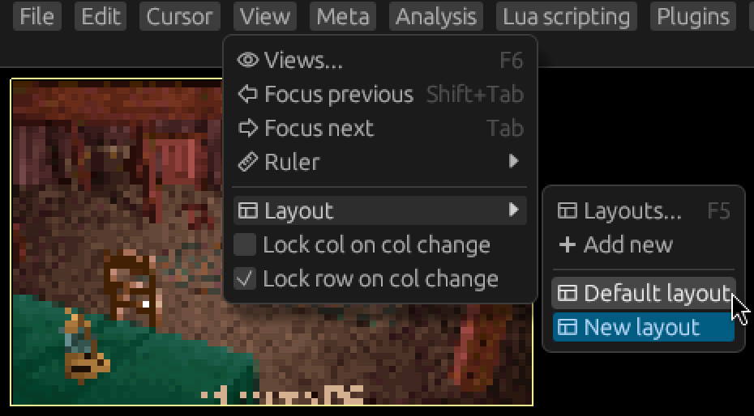
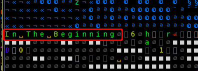
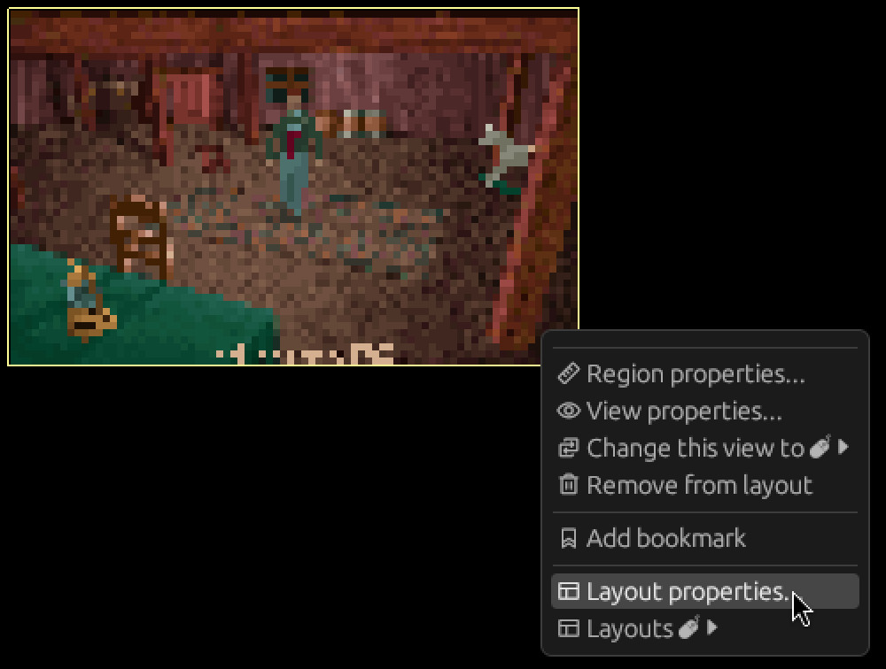
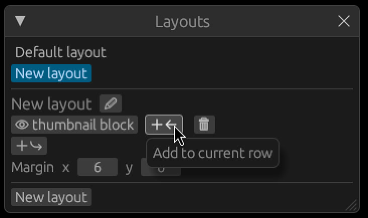
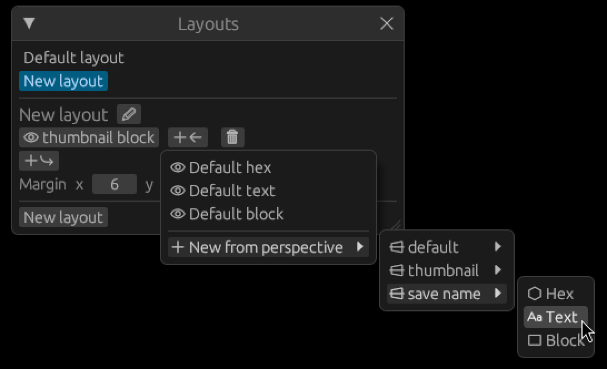
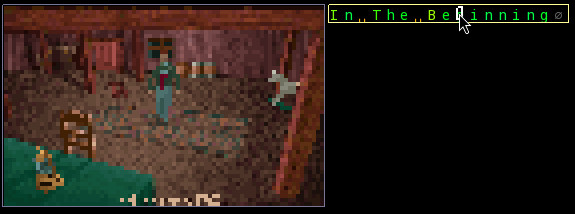
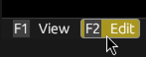
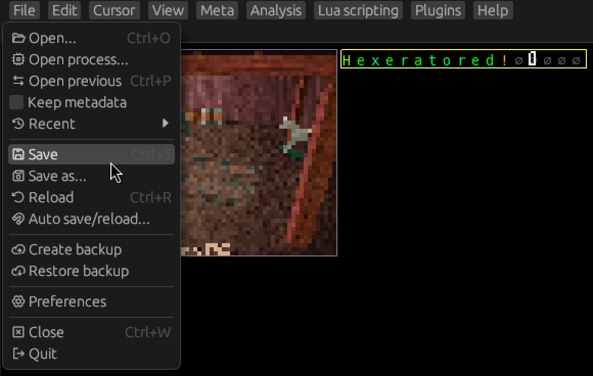
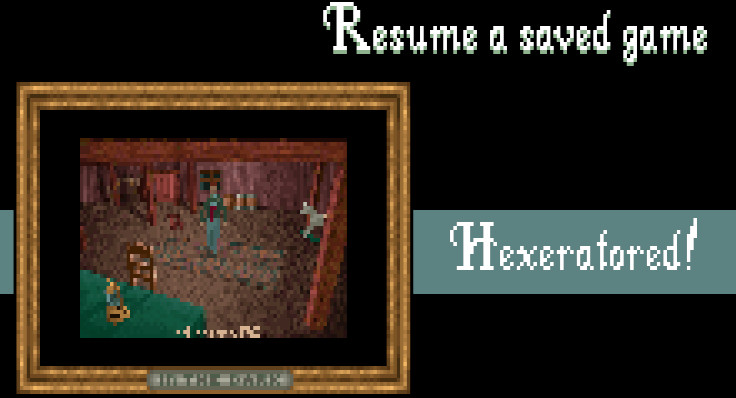

# Editing and Saving

## Switching layouts

Let's switch back to the default layout to see what else we can figure out.

Click `View -> Layout`, then select the `Default layout` from the menu.

Let's examine more of the file!

You can use the arrow keys to scroll the view.
You can also use `Page up` and `Page down` to scroll entire pages.

Huh? What's this right after the thumbnail?

It looks like the name of the save. That nul character right after is probably the nul terminator.

Let's add it to our meta!
I'll leave it as an exercise to add a region and perspective for it.
Revisit [2.3](03-selections-and-regions.md) and [2.5](05-perspectives-views-layouts.md) if you need
a refresher.

Once you're done, switch back to our custom layout.

Now let's add a text view of the save name to it.

**Tip:** You can right click the view area for a context menu.
From there, you can click `Layout properties...` to open the layouts window with the current
layout selected.

Let's add it to the left of the thumbnail! Click the `Add to current row` button next to it.

This time, let's select a text view from the menu.

Don't forget to save your metafile! (`Meta -> Save`)

## Editing the text

Click inside your new text view to make sure it's focused.
The currently focused view has a yellow border around it, rather than gray.

### Switching to edit mode

Hexerator is a modal editor.
The two modes are `View` and `Edit`.

You can see the currently active mode at the left side of the bottom panel.
Click `Edit` or press `F2` to switch to edit mode.

### Editing the text

When edit mode is active, the cursor keys move the edit cursor rather than scrolling the view.
You can press the `Home` key to jump the cursor to the beginning of the view.
Now enter whatever text you want for the save name.
You can press the `Delete` key to zero out bytes to properly nul terminate the string.

### Saving

Once you are done with your editing, you can click `File -> Save` to save the file.

Indeed, it looks like our edit has been successful.

